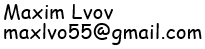

# Roboshaul TTS and Voice Conversion
This is a Hebrew phoneme-based TTS and Voice Conversion projects repository for the Robo-Shaul 2023 competition.
Robo-Shaul TTS competition was held in May 2023 in KAN Israeli Public Broadcasting Corporation. The current solution is based on several projects:
1. We use the [Dicta](https://dicta.org.il/) API for diacritization.
2. We use [OpenNMT](https://opennmt.net/) for grapheme-to-phoneme translation (G2P) from diacritized words into SAMPA phonemes.
3. We use [Grad-TTS](https://grad-tts.github.io/) for text to speech.
4. We use [soft-vc](https://github.com/bshall/soft-vc) for voice conversion.

The TTS training process involved several steps to ensure the quality of the synthesized speech. Initially, the training was conducted solely on the Roboshaul-gold dataset, for which the transcripts were much cleaner. The transcripts underwent an additional semi-automatic cleaning phase to enhance data quality. Subsequently, the task was to obtain phonetic transcripts for the dataset. To achieve this, the DICTA API was utilized to diacritize all words in the dataset, extracting multiple diacritization options (nbests) for each word.

Next, a rule-based phonetic lexicon was developed based on the diacritized nbests. To determine the correct phonetic transcriptions, an acoustic model was trained and used to align the dataset with the audio. 
For the TTS model training, only the phonetic transcripts, along with punctuation and silence marking, were utilized. 
Furthermore, the obtained phonetic transcripts were employed to train a grapheme-to-phoneme (G2P) model, which is used to automatically convert diacritized words into their phonetic transcription.

For inference, the input text is first diacritized using DICTA API, and then converted into a string of phonemes using the G2P model, and possibly a manual lexicon which can be used if the automatic phonetic transcripts are not accurate enough. Then, the TTS model is used to create audio.

For training the Voice-Conversion model, the Roboshaul-automatic dataset was utilized, consisting of 25 hours of audio. The automatic transcripts were not utilized since soft-vc training is an unsupervised process. To narrow down the selection of utterances, a filtering step was performed using X-Vector, retaining only those with minimal voice variance. Following this filtering process, approximately 20 hours of audio remained for further model training.


To try the project, you can either follow the instructions in the "Inference" section, or run a [jupyter notebook](/TTS_Demo.ipynb) <a target="_blank" href="https://colab.research.google.com/github/maxlvov/roboshaul_tts_vc/blob/main/TTS_Demo.ipynb"></a>.

The project was tested both on windows and linux, on python 3.10.

## Installation

Firstly, install all Python package requirements:

  ```bash
  pip install -r requirements.txt
  ```

Secondly, build `monotonic_align` code (Cython):

  ```bash
  cd Grad-TTS/model/monotonic_align; python setup.py build_ext --inplace; cd ../../..
  ```
## Inference
You should download the pretrained models from [here](https://drive.google.com/drive/folders/1_roT7UgozdehF-Ae-1bLOYApnpwkSs5y?usp=sharing).

To synthesis speech from a text file, run the following command:

  ```bash
  python run_tts.py --temp_speed $temp_speed --timesteps $timesteps <path_to_models_dirs> <path_to_textual_file> <path_to_output_wave_file>
  ```
  
Where temp_speed and timesteps define the tempo speed and number of timesteps in reverse diffusion.

For Voice-Conversion, run the following command:

  ```bash
  python run_vc.py <path_to_models_dirs> <path_to_input_wave_file> <path_to_output_wave_file>
  ```
## Training

Currently only the data for Grad-TTS model training is available. The training acoustic data is Roboshaul-gold which can be found [here](https://openslr.org/134/). The phonetic transcripts which are used for training are located in "Grad-TTS/resources/filelists/shaul-gold". 
Please follow the steps in the [Grad-TTS repo](https://github.com/huawei-noah/Speech-Backbones/tree/main/Grad-TTS) for the training steps.


## Contact
If you have any comments or questions, feel free to contact me.

[Connect on LinkedIn](https://www.linkedin.com/in/maxim-lvov-a0042a8b/)


